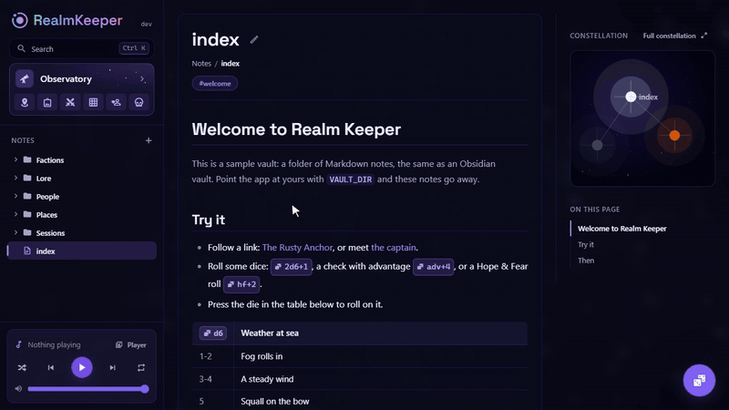
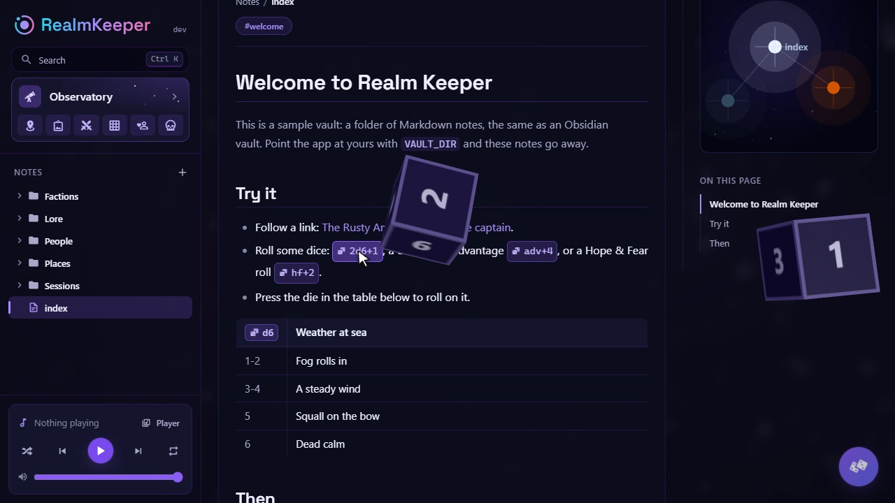
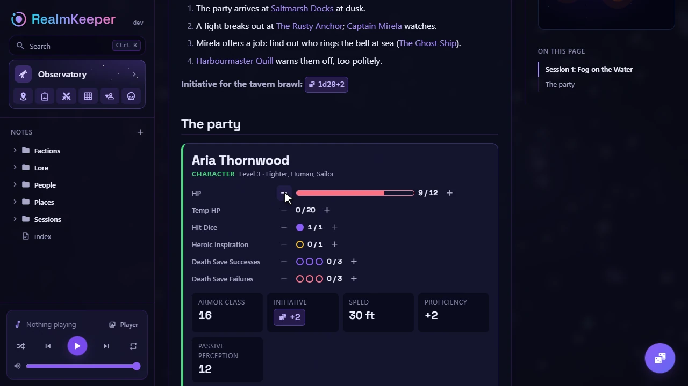
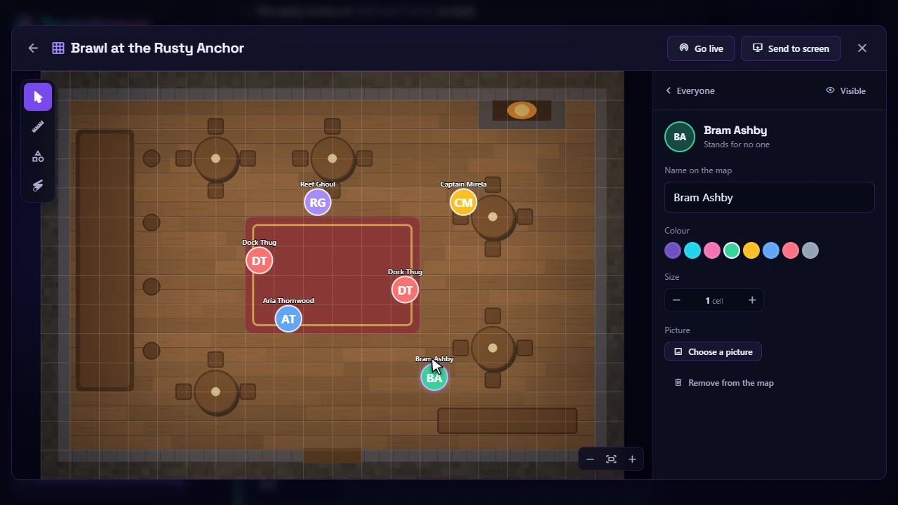
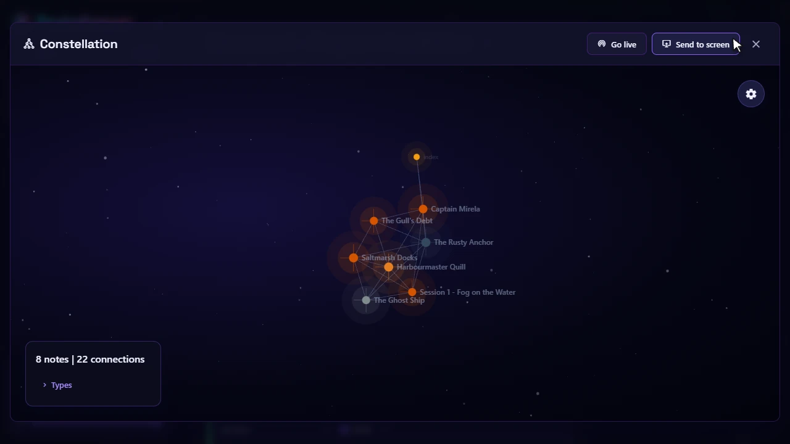

# Realm Keeper

**Your Obsidian vault, turned into a campaign wiki with everything you need at
the table.** Dice in your notes, live character sheets, battlemaps, a screen for
your players. Self-hosted, for any game system.

[](https://github.com/ArnauFauquer/Realm-Keeper/releases)
[](LICENSE)



- **Your notes stay yours.** Plain Markdown in a folder, the same one Obsidian
  opens. Edit on either side; nothing is locked into a database.
- **Built for the table.** 3D dice from any note, sheets whose counters change
  live for everyone, battlemaps, encounters, music, and a second screen for the
  players.
- **Any system, any server.** No rules built in: name your own counters and
  stats, or start from a D&D 5e, Daggerheart, Pathfinder 2e, Call of Cthulhu,
  Cyberpunk RED, Shadowdark or Blades in the Dark template. Runs from one
  `docker compose up`, on a laptop, a NAS or a Raspberry Pi.

## Try it in a minute

You need [Docker](https://docs.docker.com/get-docker/).

```bash
git clone https://github.com/ArnauFauquer/Realm-Keeper.git
cd Realm-Keeper/examples/01-minimal
docker compose up -d
```

Open http://localhost:8080. It starts with a small sample campaign; point
`VAULT_DIR` at your own vault to see your notes instead.

## What's inside

<table>
  <tr>
    <td width="50%"><br><b>Notes that play.</b> Write <code>`2d6+1`</code> and it is a button that throws 3D dice. Tables headed by a die roll on themselves. Wiki links, tags, callouts and Mermaid, as in Obsidian.</td>
    <td width="50%"><br><b>Live sheets.</b> Characters and adversaries built in a visual editor. A character's HP, spell slots or Stress change for everyone at once, on every note and map it appears in.</td>
  </tr>
  <tr>
    <td width="50%"><br><b>Battlemaps and encounters.</b> Tokens on a grid, a ruler that measures moves, areas for spells, range bands, a laser pointer, and hidden tokens your players never see.</td>
    <td width="50%"><br><b>A map of your world.</b> The constellation draws every note and link. Charts with pins, perspective scenes, a music player, and a screen (a TV, a projector, an OBS source) you send any of it to.</td>
  </tr>
</table>

Every feature, in detail: [docs/features.md](docs/features.md).

## Make it yours

Each piece is optional, and [examples/](examples) has a ready-to-run setup for
each way of combining them:

| Example | Notes | Maps, sheets, images, music | Login |
| ------- | ----- | --------------------------- | ----- |
| [01-minimal](examples/01-minimal) | a folder (your Obsidian vault) | a Docker volume | none |
| [02-minio](examples/02-minio) | a folder | MinIO, or any S3 bucket | none |
| [03-dex-local-users](examples/03-dex-local-users) | a folder | a Docker volume | users and passwords of your own |
| [04-git-vault](examples/04-git-vault) | a Git repository, pulled and pushed | a Docker volume | none |
| [05-github-google-login](examples/05-github-google-login) | a folder | a Docker volume | GitHub or Google |
| [06-server-https](examples/06-server-https) | a Git repository | MinIO | any OpenID Connect provider, with HTTPS |

## Documentation

- [Features](docs/features.md): notes, inline dice and roll tables, sheets,
  encounters, battlemaps, the Observatory, the player screen, who can see what.
- [Configuration](docs/configuration.md): your vault, where files go, signing in,
  and every setting.
- [How data is stored](docs/storage.md): the layout of the vault and the store,
  backups and upgrades from older versions.
- [Development](docs/development.md): running it from source, tests, deployment
  and the project's layout. [ARCHITECTURE.md](ARCHITECTURE.md) explains how it
  is built.

## Contributing

Contributions are welcome: see [CONTRIBUTING.md](CONTRIBUTING.md) and the
[Code of Conduct](CODE_OF_CONDUCT.md). To report a vulnerability, follow
[SECURITY.md](SECURITY.md).

## License

[MIT No Attribution (MIT-0)](LICENSE). Use, copy, modify and redistribute it
for any purpose, commercial or not, without even needing to keep the
copyright notice.
